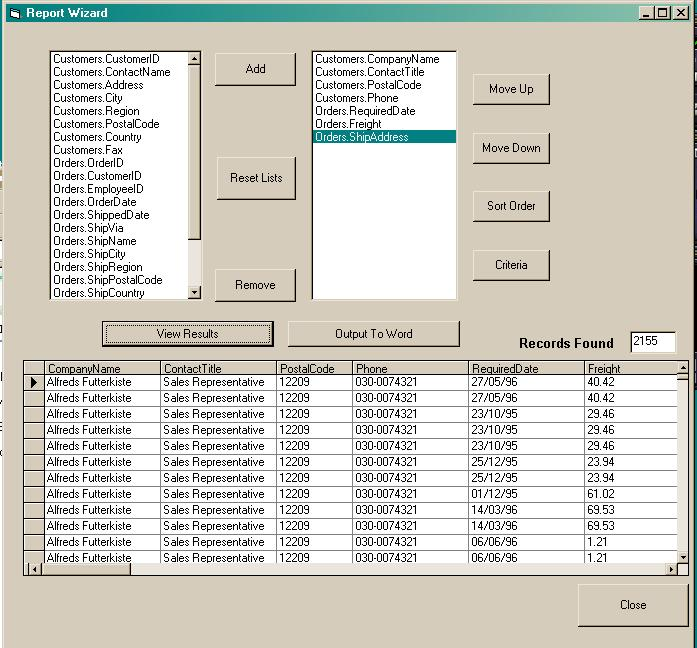



## Report Wizard

### Description

A report wizard which allows users to create their own simple reports and outputs them to a word doc. Includes sorting and criteria. I have modified this from Oracle to Access for demo purposes. I am also still working on it so any positive feedback would be appreciated. There are a few more things I would like to do like sort the Criteria operators according to datatype with, add totals. Feel free to use and modify. If you come up with anything good send it on!!

This is the first app i have uploaded so I hope it works!!!!!

Please read the attached readme file as there is a few things to do before the app works. i.e. add a query to a database.
 
### More Info
 
Please read the attached readme file as there is a few things to do before the app works. i.e. add a query to a database.

             |
---                |---
**Submitted On**   |2001-08-28 12:49:48
**By**             |[ronniec](https://github.com/Planet-Source-Code/PSCIndex/blob/master/ByAuthor/ronniec.md)
**Level**          |Intermediate
**User Rating**    |4.6 (23 globes from 5 users)
**Compatibility**  |VB 6\.0
**Category**       |[Databases/ Data Access/ DAO/ ADO](https://github.com/Planet-Source-Code/PSCIndex/blob/master/ByCategory/databases-data-access-dao-ado__1-6.md)
**World**          |[Visual Basic](https://github.com/Planet-Source-Code/PSCIndex/blob/master/ByWorld/visual-basic.md)
**Archive File**   |[Report Wiz254688282001\.zip](https://github.com/Planet-Source-Code/ronniec-report-wizard__1-26720/archive/master.zip)

